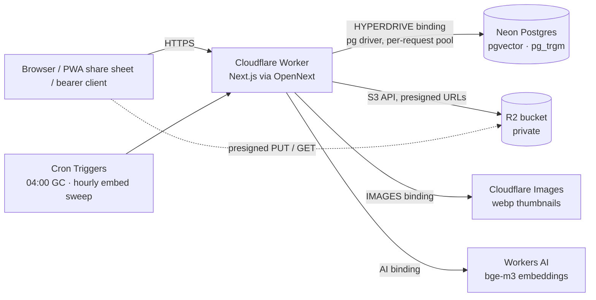

# Architecture

One Next.js 16 app, deployed as a single Cloudflare Worker, in front of a Postgres database and an S3 bucket. No queues, no separate services, no middleware layer. This page is the map; [`../PROJECT.md`](../PROJECT.md) has the full schema and the principles that constrain everything below.

## Runtime shape

| Concern | Where | How |
| --- | --- | --- |
| Entry | `worker.ts` | OpenNext's generated handler plus a `scheduled()` export that maps each cron expression to an internal `GET /api/admin/*` call carrying `CRON_SECRET` |
| Pages | `src/app/(app)/*` | All `force-dynamic`. Each page calls `requireSession()` itself — **there is no middleware**; OpenNext on Workers does not run `proxy.ts`/`middleware.ts`, so auth is explicit per page and per route |
| API | `src/app/api/**/route.ts` | Route handlers; every one except `POST /api/auth/login` starts with `authorize()`, which accepts the session cookie or `Authorization: Bearer <API_TOKEN or CRON_SECRET>`. Both bearer tokens are full-access — the distinction is who holds them, not what they can do |
| DB | `src/db/index.ts` | Drizzle over `pg`. A **pool per request context** (keyed on the OpenNext `ExecutionContext` in a `WeakMap`), because Workers forbid reusing a socket across requests. Hyperdrive keeps Neon warm so per-request connects are cheap. Falls back to `DATABASE_URL` for scripts, tests, and `next dev` |
| Schema | `src/db/*.sql` + `src/db/schema.ts` | Raw SQL migrations are the source of truth; the Drizzle schema mirrors them for typed queries. `scripts/migrate.ts` applies files alphabetically, tracked in `_migrations` |
| Object storage | `src/lib/r2.ts` | `aws4fetch` against the S3 API, path-style URLs. `R2_ENDPOINT` overrides the derived Cloudflare endpoint so MinIO (or any S3) is a drop-in |
| Images | `src/lib/files.ts` | Dimensions + `thumb-400`/`thumb-1200` webp variants via the `IMAGES` binding after upload confirmation |
| Embeddings | `src/lib/embeddings.ts` | `@cf/baai/bge-m3`, 1024 dims. Uses the `AI` binding when deployed; under `next dev` the binding is a stub, so it uses the Workers AI REST API if `CF_ACCOUNT_ID`/`CF_AI_TOKEN` are set, else embedding is skipped and search degrades to FTS |
| Background work | `after()` from `next/server` | Link OG capture and embedding run after the response is sent. No job queue; an hourly cron sweep catches anything that was missed |

## Domain model in one paragraph

Everything is a row in `cards` with a `type` (`thought`, `quote`, `link`, `video`, `document`, `project`, `board`, `mantra`) and a JSONB `props` bag for type-specific data (tldraw snapshot for boards, OpenGraph metadata for links, `source` provenance for everything). Boards are cards; a card appears on a board through a row in `placements` (`board_id`, `card_id`, `x`, `y`, `w`, `h`, `z`), so membership is many-to-many and nesting is free. `edges` are labelled, described, directed links between cards. `tags`/`card_tags` are flat. `files` + `file_refs` form a reference ledger that drives garbage collection. `triaged_at` separates the inbox (null) from the library. There is deliberately **no `parent_id`**.

## Capture path

1. `POST /api/cards` (browser composer, share target, or bearer client) validates with zod, inserts the card, stamps `props.source` (`typed` / `web:<domain>` / `share` / `upload` / `book`), and syncs `file_refs` from `` embeds in the body.
2. `after()`: if it is a link, `captureLink` fetches the page, parses OpenGraph (or, for hosts in `OEMBED_ENDPOINT` such as YouTube, asks their oEmbed endpoint), downloads the image into R2 as a file with an `og_cache` ref, and writes metadata into `props`. The title is filled when empty or still equal to the previous auto-filled one. Then `embedCard` hashes `title + body`, skips if unchanged, otherwise embeds and stores the vector.
3. The browser emits a `card-changed` window event (`src/lib/card-events.ts`); the stream, inbox count, and facet counts refetch.

## Files

Upload is client-driven and dedupes on content hash: the client computes sha256 and asks `POST /api/files/presign`; if an `active` file with that hash exists the existing id comes back, otherwise a `pending` row and a presigned PUT. After the PUT the client calls `POST /api/files/:id/confirm`; the server verifies the object, generates variants, and flips the row to `active`. Reads go through `GET /api/files/:id/:variant`, which redirects to a short-TTL presigned GET — the bucket is never public. Nightly GC removes stale `pending` rows, unreferenced `active` files (by prefix), and hard-deletes cards soft-deleted more than 30 days ago. `POST /api/admin/reconcile` diffs bucket keys against `files.r2_prefix` and removes strays.

## Search

`GET /api/search?q=&mode=quick|fts|semantic|hybrid` (`src/lib/search.ts`):

- **quick** — `word_similarity` on `title` (pg_trgm), threshold 0.2; typo-tolerant as-you-type.
- **fts** — `websearch_to_tsquery` against the generated `search` tsvector, `ts_rank`, title weighted A over body B.
- **semantic** — cosine distance over `embedding` using the HNSW index; 503 if no embedding provider is configured.
- **hybrid** (default) — fts and semantic in parallel, merged with reciprocal rank fusion (`src/lib/rrf.ts`, k = 60). Returns `degraded: true` when it had to fall back to fts alone; the UI shows an amber note.

## Front end

| Area | Files | Notes |
| --- | --- | --- |
| Header | `src/app/(app)/layout.tsx`, `components/nav/ScopeNav.tsx`, `components/search/GlobalSearch.tsx`, `components/capture/AddButton.tsx` | Tabs `inbox · library · tags · settings`, the `⌘K` palette, the `+ Add ⌘J` button. The search and capture overlays are portaled to `document.body` because the header's `backdrop-blur` would clip fixed children |
| Stream | `components/brain/BrainPage.tsx` | Owns URL state (`scope`, `view`, `type`, `tag`, `card`), fetches `/api/cards` and `/api/cards/facets`, renders `Shell` (filter row) + `Timeline` or `Desk` |
| Filters | `components/brain/FacetMenu.tsx`, `Shell.tsx` | One control for kind/tag (multi) and for the composer's kind picker (single) |
| Capture | `components/capture/CaptureDialog.tsx`, `components/brain/Composer.tsx`, `lib/capture-bus.ts` | `⌘J` toggles the dialog; `openCapture({ onCreated })` lets a board canvas receive the new card and place it. Tags picked here are sent as `tagIds` and file the card to the library |
| Tags | `components/TagPicker.tsx`, `components/TagManager.tsx`, `app/(app)/tags/page.tsx` | `TagPicker` attaches/creates in the card modal and composer; `/tags` renames (merging on name clash) and deletes |
| Card | `components/card/CardModal.tsx` (+ `CardEditor`, `RelationEditor`, `BoardPicker`) | `?card=<id>` opens it; back button closes. Hotkeys `a` archive, `e` edit, `b` file to board, `t` tag, `l` connect a card (the "Connected cards" section; edges, not URLs) |
| Boards | `components/board/BoardCanvas.tsx`, `CardShape.tsx` | tldraw with a custom shape per placed card. Placements are authoritative; native tldraw shapes (arrows, scribbles) persist as a filtered snapshot in the board card's `props` |

Styling is Tailwind v4 with design tokens in `src/app/globals.css` (dark ink surfaces, acid `#B6FF2E` accent, Bricolage Grotesque / Space Grotesk / JetBrains Mono). Card types get distinct typography in `components/card-style.ts`.

## Scheduled work

`wrangler.jsonc` declares two crons; `worker.ts` dispatches them:

| Cron | Route | Purpose |
| --- | --- | --- |
| `0 4 * * *` | `GET /api/admin/gc` | Expired soft-deletes, stale pending uploads, orphaned files, bucket purge |
| `15 * * * *` | `GET /api/admin/embed-sweep` | Embed cards whose text changed since `embedded_at` or that never embedded |

Both are also buttons on `/settings`.
