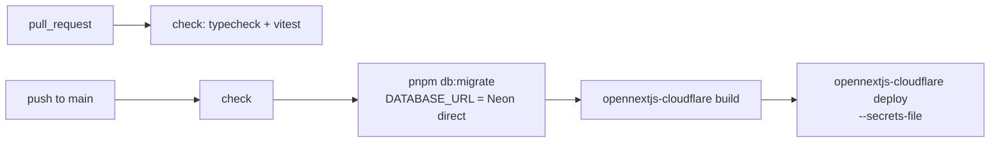

# Deployment

Production is one Cloudflare Worker (`second-brain`), a Neon Postgres database reached through Hyperdrive, and a private R2 bucket. GitHub Actions owns the pipeline: every push to `main` typechecks, tests, **migrates, then deploys**. Nobody runs `pnpm deploy` by hand against production.

## Pipeline (`.github/workflows/deploy.yml`)



- The `deploy` job uses the `production` GitHub environment and a `production-deploy` concurrency group with `cancel-in-progress: false`, so deploys (and therefore migrations) queue rather than overlap.
- A failed migration stops the deploy. Because the migration runs **before** the new Worker is live, every migration must be safe for the *currently deployed* code: add columns first, backfill, switch code, drop later.
- Worker secrets are GitHub repo secrets written to a temp `--secrets-file` at deploy time. A fresh Worker is fully configured on its first deploy; rotating a secret is `gh secret set NAME` + re-run the workflow (`workflow_dispatch` is enabled).

## Standing up your own instance

### 1. Cloudflare

Everything is pinned to an account in `wrangler.jsonc` (`account_id`) so a stray login cannot deploy somewhere else — change it to yours.

```sh
pnpm cf login                           # project-local wrangler auth in .cf-auth/
pnpm cf r2 bucket create second-brain   # keep it private; the app only uses presigned URLs
pnpm cf hyperdrive create second-brain \
  --connection-string="<Neon DIRECT connection string>" \
  --caching-disabled
```

- **Hyperdrive caching must stay disabled.** It caches reads for 60s by default, which would hide a card you just captured from the next page load. Put the returned `id` into `wrangler.jsonc` → `hyperdrive[0].id`.
- `images: { binding: "IMAGES" }` and `ai: { binding: "AI" }` need no setup beyond the Images and Workers AI products being enabled on the account; both are within free tiers at single-user scale.
- Create an R2 API token (Object Read & Write, scoped to the bucket) for `R2_ACCESS_KEY_ID` / `R2_SECRET_ACCESS_KEY`.
- Create a Cloudflare API token for CI from the *Edit Cloudflare Workers* template (that is what `opennextjs-cloudflare deploy` runs under); this becomes `CLOUDFLARE_API_TOKEN`.
- Set `vars.R2_ACCOUNT_ID` and `vars.R2_BUCKET` in `wrangler.jsonc`.

### 2. Neon

Create a project; enable `vector` and `pg_trgm` (the first migration runs `CREATE EXTENSION IF NOT EXISTS`, which works on Neon's default role). Keep two connection strings:

- **Direct** (non-pooled): Hyperdrive's origin and CI's `DATABASE_URL` for migrations.
- You do not need the pooled one; Hyperdrive is the pooler.

### 3. GitHub

Repo secrets (Settings → Secrets → Actions, or `gh secret set`):

| Secret | Purpose |
| --- | --- |
| `CLOUDFLARE_API_TOKEN` | Deploys the Worker |
| `DATABASE_URL` | Neon direct URL; migrations only |
| `APP_PASSWORD_HASH` | `pnpm hash-password "…"` |
| `SESSION_SECRET` | `openssl rand -hex 32` |
| `API_TOKEN` | Bearer for non-browser capture (menu-bar app, iOS Shortcut) |
| `CRON_SECRET` | Bearer the cron dispatcher in `worker.ts` presents to `/api/admin/*` |
| `R2_ACCESS_KEY_ID`, `R2_SECRET_ACCESS_KEY` | S3 credentials for the bucket |

Create a `production` environment (no approval gate required, but it is where you would add one). Push to `main`; the first run migrates an empty database and deploys.

### 4. First login

Visit the Worker URL, log in with the password you hashed. Cron Triggers (`0 4 * * *` GC, `15 * * * *` embed sweep) are registered by the deploy from `wrangler.jsonc` → `triggers.crons`.

## Secrets and config: who owns what

| Kind | Lives in | Example |
| --- | --- | --- |
| Non-secret config | `wrangler.jsonc` `vars` | `R2_ACCOUNT_ID`, `R2_BUCKET` |
| Bindings | `wrangler.jsonc` | `HYPERDRIVE`, `IMAGES`, `AI`, `ASSETS` |
| Secrets | GitHub repo secrets → `--secrets-file` on deploy | everything in the table above |
| Local equivalents | `.env.local` (`next dev`), `.dev.vars` (`pnpm preview`) | git-ignored |

`wrangler secret put` is never used; the workflow is the only writer, which keeps "what is deployed" answerable from GitHub alone.

## Operating

- **Logs:** `observability.enabled: true` in `wrangler.jsonc`; use the Workers dashboard or `pnpm cf tail second-brain`.
- **Rotate the password:** `pnpm hash-password "new"` → `gh secret set APP_PASSWORD_HASH` → re-run the workflow. Existing sessions stay valid until they expire (30 days rolling) unless you also rotate `SESSION_SECRET`.
- **Run maintenance by hand:** buttons on `/settings`, or `curl -X POST -H "Authorization: Bearer $CRON_SECRET" https://<worker>/api/admin/gc`.
- **Escape hatch:** `/settings` → *Export everything* streams a zip of every card as markdown plus every file. `pg_dump` against the Neon direct URL covers the rest.
- **Preview before merging an edge-sensitive change:** `pnpm preview` runs the built Worker locally under wrangler with `.dev.vars`, which is the only way to exercise `worker.ts`, bindings, and the OpenNext output before CI does.
